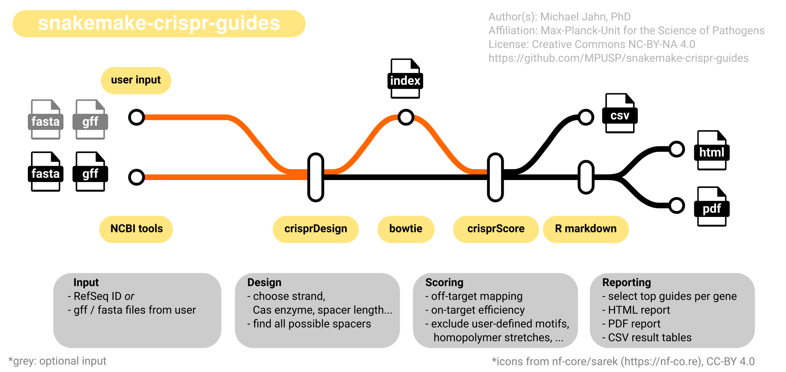
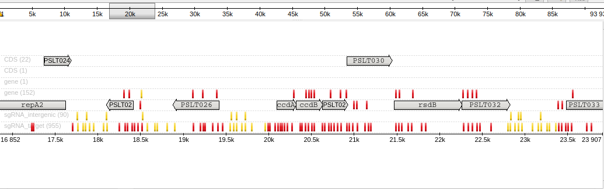
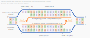

# snakemake-crispr-guides

[](https://snakemake.github.io)
[](https://github.com/MPUSP/snakemake-crispr-guides/actions/workflows/main.yml)
[](https://docs.conda.io/en/latest/)
[](https://sylabs.io/docs/)
[](https://snakemake.github.io/snakemake-workflow-catalog/docs/workflows/MPUSP/snakemake-crispr-guides.html)

---

A Snakemake workflow for the design of small guide RNAs (sgRNAs) for CRISPR applications.

- [snakemake-crispr-guides](#snakemake-crispr-guides)
  - [Usage](#usage)
  - [Workflow overview](#workflow-overview)
  - [Deployment options](#deployment-options)
  - [Running the workflow](#running-the-workflow)
    - [Input data](#input-data)
    - [Parameters](#parameters)
    - [Target type](#target-type)
    - [Off-target scores](#off-target-scores)
    - [On-target scores](#on-target-scores)
    - [Strand specificity](#strand-specificity)
  - [Output](#output)
  - [Authors](#authors)
  - [License](#license)
  - [Contributions](#contributions)
  - [References](#references)

## Usage

The usage of this workflow is described in the [Snakemake Workflow Catalog](https://snakemake.github.io/snakemake-workflow-catalog/docs/workflows/MPUSP/snakemake-crispr-guides.html).

Detailed information about input data and workflow configuration can also be found in the [`config/README.md`](config/README.md).

If you use this workflow in a paper, don't forget to give credits to the author(s) by citing the URL of this (original) repository and its DOI (see above).

## Workflow overview

<!-- include logo-->


---

This workflow is a best-practice workflow for the automated generation of guide RNAs for CRISPR applications. It's main purpose is to provide a simple, efficient and easy-to-use framework to design thousands of guides simultaneously for CRISPR libraries from as little input as an organism's name/genome ID. For the manual design of single guides, users are instead referred to even simpler web resources such as [Chop-Chop](http://chopchop.cbu.uib.no/), [CRISPick](https://portals.broadinstitute.org/gppx/crispick/public), or [Cas-OFFinder/Cas-Designer](http://www.rgenome.net/cas-designer/).

This workflow relies to a large degree on the underlying [Bioconductor package ecosystem `crisprVerse`](http://bioconductor.org/packages/release/bioc/html/crisprVerse.html), published in 2022 by:

> Hoberecht, L., Perampalam, P., Lun, A. et al. _A comprehensive Bioconductor ecosystem for the design of CRISPR guide RNAs across nucleases and technologies_. Nat Commun 13, 6568 (**2022**). https://doi.org/10.1038/s41467-022-34320-7.

The workflow is built using [snakemake](https://snakemake.readthedocs.io/en/stable/) and consists of the following steps:

1. Obtain genome database in `fasta` and `gff` format (`python`, [NCBI Datasets](https://www.ncbi.nlm.nih.gov/datasets/docs/v2/))
   1. Using automatic download from NCBI with a `RefSeq` ID
   2. Using user-supplied files
2. Find all possible guide RNAs for the given sequence, with many options for customization (`R`, `crisprVerse`)
3. Collect on-target and off-target scores (`R`, `crisprVerse`, `Bowtie`)
4. Filter and rank guide RNAs based on scores and return final list (`R`, `crisprVerse`)
5. Generate report with overview figures and statistics (`R markdown`)
6. Return report as HTML and PDF files (`weasyprint`)
7. Export module logs and versions

If you want to contribute, report issues, or suggest features, please get in touch on [github](https://github.com/MPUSP/snakemake-crispr-guides).

## Deployment options

To run the workflow from command line, change the working directory.

```bash
cd path/to/snakemake-crispr-guides
```

Adjust options in the default config file `config/config.yml`.
Before running the complete workflow, you can perform a dry run using:

```bash
snakemake --dry-run
```

To run the workflow with test files using **conda**:

```bash
snakemake --cores 2 --sdm conda --directory .test
```

To run the workflow with test files using **apptainer**:

```bash
snakemake --cores 2 --sdm conda apptainer --directory .test
```

## Running the workflow

### Input data

The workflow requires the following input:

1. An NCBI Refseq ID, e.g. `GCF_000006945.2`. Find your genome assembly and corresponding ID on [NCBI genomes](https://www.ncbi.nlm.nih.gov/data-hub/genome/)
2. OR use a custom pair of `*.fasta` file and `*.gff` file that describe the genome of choice

Important requirements when using custom `*.fasta` and `*.gff` files:

- `*.gff` genome annotation must have the same chromosome/region name as the `*.fasta` file (example: `NC_003197.2`)
- `*.gff` genome annotation must have `gene` and `CDS` type annotation that is automatically parsed to extract transcripts
- `*.gff` genome annotation must have additional qualifiers `Name=...`, `ID=...`, and `Parent=...` for `CDS`s
- all chromosomes/regions in the `*.gff` genome annotation must be present in the `*.fasta` sequence
- but not all sequences in the `*.fasta` file need to have annotated genes in the `*.gff` file

### Parameters

This table lists all parameters that can be used to run the workflow.

| parameter              | type    | details                                        | default                           |
| ---------------------- | ------- | ---------------------------------------------- | --------------------------------- |
| GET_GENOME             |         |                                                |                                   |
| database               | string  | one of `ncbi`, `manual`                        | `ncbi`                            |
| assembly               | string  | RefSeq ID                                      | `GCF_000006945.2`                 |
| fasta                  | path    | optional input                                 | `Null`                            |
| gff                    | path    | optional input                                 | `Null`                            |
| gff_source_type        | list    | allowed source types in GFF file               | `'RefSeq': 'gene', ...`           |
| DESIGN_GUIDES          |         |                                                |                                   |
| target_region          | numeric | use subset of regions for testing              | `["NC_003277.2"]`                 |
| target_type            | string  | specify targets for guide design (see below)   | `["target", "intergenic", "ntc"]` |
| tss_window             | numeric | upstream/downstream window around TSS          | `[0, 500]`                        |
| tiling_window          | numeric | window size for intergenic regions             | `1000`                            |
| tiling_min_dist        | numeric | min distance between TSS and intergenic region | `0`                               |
| circular               | logical | is the genome circular?                        | `False`                           |
| canonical              | logical | only canonical PAM sites are included          | `True`                            |
| strands                | string  | target `coding`, `template` or `both`          | `both`                            |
| spacer_length          | numeric | desired length of guides                       | `20`                              |
| guide_aligner          | string  | one of `biostrings`, `bowtie`                  | `biostrings`                      |
| crispr_enzyme          | string  | CRISPR enzyme ID                               | `SpCas9`                          |
| score_methods          | string  | see _crisprScore_ package                      | default scores are listed below   |
| score_weights          | numeric | opt. weights when calculating mean score       | `[1, 1, 1, 1, 1, 1]`              |
| restriction_sites      | string  | sequences to omit in entire guide              | `Null`                            |
| bad_seeds              | string  | sequences to omit in seed region               | `["ACCCA", "ATACT", "TGGAA"]`     |
| no_target_controls     | numeric | number of non targeting guides (neg. controls) | 100                               |
| FILTER_GUIDES          |         |                                                |                                   |
| filter_best_per_gene   | numeric | max number of guides to return per gene        | `10`                              |
| filter_best_per_tile   | numeric | max number of guides to return per ig/tile     | `10`                              |
| filter_score_threshold | numeric | mean score to use as lower limit               | `Null`                            |
| filter_multi_targets   | logical | remove guides that perfectly match >1 target   | `True`                            |
| filter_rna             | logical | remove guides that target e.g. rRNA or tRNA    | `True`                            |
| gc_content_range       | numeric | range of allowed GC content                    | `[30, 70]`                        |
| fiveprime_linker       | string  | optionally add 5' linker to each guide         | `Null`                            |
| threeprime_linker      | string  | optionally add 3' linker to each guide         | `Null`                            |
| export_as_gff          | logical | export result table to `.gff` file             | `True`                            |
| export_as_fasta        | logical | export result table to `.fasta` file           | `True`                            |
| REPORT                 |         |                                                |                                   |
| show_examples          | numeric | number of genes to show guide position         | `10`                              |
| show_genomic_range     | numeric | genome start and end pos to show tiling guides | `[0, 50000]`                      |

### Target type

One of the most important options is to specify the _type of target_ with the `target_type` parameter. The pipeline can generate up to three different types of guide RNAs:

1. guides for **targets** - these are typically genes, promoters or other annotated genetic elements determined from the supplied GFF file. The pipeline will try to find the best guides by position and score targeting the defined window around the start of the gene/feature (parameter `tss_window`). The number of guides is specified with `filter_best_per_gene`.
2. guides for **intergenic regions** - for non-annotated regions (or in the absence of any targets), the pipeline attempts to design guide RNAs using a 'tiling' approach. This means that the supplied genome is subdivided into 'tiles' (bins) of width `tiling_window`, and the best guide RNAs per window are selected. The number of guides is specified with `filter_best_per_tile`.
3. guides **not targeting anything** - this type of guide RNAs is most useful as negative control, in order to gauge the effect of the genetic background on mutant selection without targeting a gene. These guides are random nucleotide sequences with the same length as the target guide RNAs. The no-target control guides are named `NTC_<number>` and exported in a separate table (`results/filter_guides/guideRNAs_ntc.csv`). Some very reduced checks are done for these guides, such as off-target binding. mMst on-target checks are omitted for these guides as they have no defined binding site, strand, or other typical guide properties.

The following figure gives a nice overview about the designed guide RNAs for the different types. The organism that was used is _Salmonella typhimurium_, the example data. _Red_: guides targeting the TSS window of genes. Yellow: guides targeting intergenic regions. _Grey: annotated genes_.

<!-- include example for guide design -->


### Off-target scores

The pipeline maps each guide RNA to the target genome and -by default- counts the number of alternative alignments with 1, 2, 3, or 4 mismatches. All guide RNAs that map to any other position including up to 4 allowed mismatches are removed.
An exception to this rule is made for guides that perfectly match multiple targets when the `filter_multi_targets` is set to `False` (default: `True`). The reasoning behind this rule is that genomes often contain duplicated genes/targets, and the default but sometimes undesired behavior is to remove all guides targeting the two or more duplicates. If set to `False`, these guides will not be removed and duplicated genes will be targeted even if they are located at different sites.

### On-target scores

The list of available on-target scores in the [R crisprScore package](https://github.com/crisprVerse/crisprScore) is larger than the different scores included by default. It is important to note that the computation of some scores does not necessarily make sense for the design of every CRISPR library. For example, several scores were obtained from analysis of Cas9 cutting efficiency in human cell lines. For such scores it is questionable if they are useful for the design of a different type of library, for example a dCas9 CRISPR inhibition library for bacteria.

Another good reason to exclude some scores are the computational resources they require. Particularly deep learning-derived scores are calculated by machine learning models that require both a lot of extra resources in terms of disk space (downloaded and installed _via_ `basilisk` and `conda` environments) and processing power (orders of magnitude longer computation time).

Users can look up all available scores on the [R crisprScore github page](https://github.com/crisprVerse/crisprScore) and decide which ones should be included. In addition, the default behavior of the pipeline is to compute an average score and select the top N guides based on it. The average score is the _weighted mean_ of all single scores and the `score_weights` can be defined in the `config/config.yml` file. If a score should be excluded from the ranking, it's weight can simply be set to zero.

The default scores are:

- `ruleset1`, `ruleset3`, `crisprater`, and `crisprscan` from the `crisprScore` package
- `tssdist` as an additional score representing the relative distance to the promoter. Only relevant for CRISRPi repression
- `genrich` as an additional score representing the `G` enrichment in the -4 to -14 nt region of a spacer ([Miao & Jahn et al., 2023](https://www.biorxiv.org/content/10.1101/2023.02.13.528328v1)). Only relevant for CRISPRi repression

### Strand specificity

<!-- include illustration of guide design -->


The strand specificity is important for some CRISPR applications. In contrast to the `crisprDesign` package, functions were added to allow the design of guide RNAs that target either both strands, or just the coding (non-template) strand, or the template strand. This can be defined with the `strands` parameter in the config file.

- For CRISPRi (inhibition) experiments, the literature recommends to target the **coding strand for the CDS** or **both strands for the promoter** ([Larson et al., Nat Prot, 2013](http://dx.doi.org/10.1038/nprot.2013.132))
- this pipeline will automatically filter guides for the chosen strand
- for example, if only guides for the coding (non-template) strand are desired, genes on the "+" strand will be targeted with reverse-complement guides ("-"), and genes on the "-" strand with "+" guides.

## Output

The workflow generates the following output from its modules:

<details markdown="1">
<summary>get_genome</summary>

- `genome.fasta`: Supplied or downloaded fasta file
- `genome.gff`: Supplied or downloaded gff file
- `log.txt`: Log file for this module

</details>

<details markdown="1">
<summary>design_guides</summary>

- `guideRNAs_target.RData`: GuideSet with all designed guide RNAs for genes
- `guideRNAs_intergenic.RData`: GuideSet with all designed guide RNAs for intergenic regions
- `guideRNAs_ntc.RData`: GuideSet with all designed non-targeting control guide RNAs
- `log.txt`: Log file for this module

</details>

<details markdown="1">
<summary>filter_guides</summary>

- `guideRNAs_target.csv (.gff) (.fasta)`: Table with all remaining guide RNAs targeting genes after filtering
- `guideRNAs_intergenic.csv (.gff) (.fasta)`: Table with all remaining guide RNAs targeting intergenic regions after filtering
- `guideRNAs_ntc.csv (.gff) (.fasta)`: GuideSet with all quality filtered non-targeting control guide RNAs
- `guideRNAs_target_failed.csv`: Table with genes/targets where no guide RNAs were designed. Typical reasons for failure are very short target sites, or overlapping annotation with other genes/targets such that candidate guide RNAs would target multiple annotated genes.
- `<target>_log.txt`: Log file for filtering the respective target type

</details>

<details markdown="1">
<summary>report</summary>

- `report.html`: HTML report with summary statistics and other information about the designed library
- `report.pdf`: PDF version of the HTML report. Does not contain table previews
- `<report>_log.txt`: Log file for making the respective report

</details>

## Authors

- The custom `snakemake`, `R`, `R markdown`, and `python` scripts were written by Michael Jahn, PhD
- Affiliation: [Max-Planck-Unit for the Science of Pathogens](https://www.mpusp.mpg.de/) (MPUSP), Berlin, Germany
- Visit the MPUSP github page at https://github.com/MPUSP for info on this workflow and other projects
- Visit the author's github page at https://github.com/m-jahn for info on other projects

## License

The code in this repository is published with the [MIT](https://choosealicense.com/licenses/mit/) license, that means:

- You are free to use this software for scientific or commercial purposes
- You are free to copy, distribute, and modify the software
- On the condition that the license must be included in all instances of this software
- The software is provided "as is", without any warranty for its use
- All external software obtained by installation of this software is licensed by its own terms and is not covered by this license

## Contributions

- Contributions to this package are welcome!
- Please get in touch on github by [filing a new issue with your suggestion](https://github.com/MPUSP/snakemake-crispr-guides/issues)
- After initial discussion, you are welcome to submit your pull request

## References

- Essential tools are linked in the top section of this document
- The core of this workflow is the [Bioconductor package `crisprVerse`](http://bioconductor.org/packages/release/bioc/html/crisprVerse.html):

> Hoberecht, L., Perampalam, P., Lun, A. et al. _A comprehensive Bioconductor ecosystem for the design of CRISPR guide RNAs across nucleases and technologies_. Nat Commun 13, 6568 (**2022**). https://doi.org/10.1038/s41467-022-34320-7.
